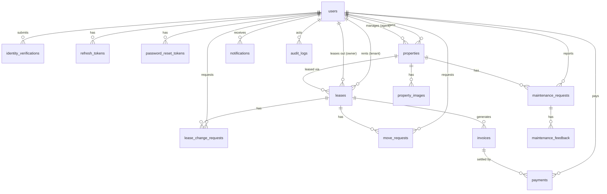

# Database Schema Reference

A reference for the tables, fields, and relationships behind HomeLink, the property-management platform connecting owners, agents, tenants, and admins across listing, leasing, payments, and maintenance.

**Engine:** PostgreSQL · **Tables:** 16 · **Domains:** 6 · **Prepared:** 2026-07-12

---

## Overview

Every table belongs to one of six domains. Data flows roughly in this order: a person is onboarded, a property is listed, a lease connects tenant to property, and billing, maintenance, and notifications follow from that lease.

| Domain | Purpose | Tables |
|---|---|---|
| Identity & Access | Accounts, roles, verification, login sessions | `users`, `identity_verifications`, `refresh_tokens`, `password_reset_tokens` |
| Property Management | Listings owners and agents publish for rent | `properties`, `property_images` |
| Leasing | Agreements, renewals/terminations, move in/out | `leases`, `lease_change_requests`, `move_requests` |
| Payments & Billing | Rent invoices and the payments settling them | `invoices`, `payments` |
| Maintenance | Tenant repair requests and post-fix feedback | `maintenance_requests`, `maintenance_feedback` |
| Platform | Cross-cutting notifications, audit trail, config | `notifications`, `audit_logs`, `platform_settings` |

Flow: **Identity → Property → Leasing → Billing**, with **Leasing → Maintenance**, and **all domains → Platform**.

---

## Entity-Relationship Diagram

*Renders automatically on GitHub. In Notion, paste this block into a `/mermaid` (Mermaid diagram) block to render it visually — a plain code block will just show the text.*

---

## Identity & Access

### `users`
Every person on the platform — tenant, owner, agent, or admin — in one table, distinguished by role. **PK:** `id`

| Column | Type | Notes |
|---|---|---|
| id | uuid | Primary key, generated by the database |
| email | varchar(255) | Required · unique |
| password_hash | text | Required |
| role | enum `user_role` | Default `tenant` |
| first_name / last_name | varchar(100) | Required |
| phone | varchar(30) | Optional |
| avatar_url | text | Optional |
| is_verified | boolean | Identity document approved |
| is_approved | boolean | Account cleared to use the platform |
| is_active | boolean | Soft-disable switch |
| created_at / updated_at | timestamptz | Auto-managed |

### `identity_verifications`
A document a user submitted to prove their identity, and the admin decision on it. **PK:** `id`

| Column | Type | Notes |
|---|---|---|
| user_id | uuid → users.id | Required · deleted with the user |
| document_url | text | Required |
| status | enum `verification_status` | Default `pending` |
| reviewed_by | uuid → users.id | Admin who reviewed it |
| review_notes | text | Optional |
| reviewed_at | timestamptz | Optional |
| created_at | timestamptz | Auto-managed |

### `refresh_tokens`
Long-lived session tokens used to silently renew a login without re-entering a password. **PK:** `id`

| Column | Type | Notes |
|---|---|---|
| user_id | uuid → users.id | Required · deleted with the user |
| token_hash | text | Required, stored hashed |
| expires_at | timestamptz | Required |
| revoked_at | timestamptz | Set on logout / revocation |
| created_at | timestamptz | Auto-managed |

### `password_reset_tokens`
One-time tokens issued for "forgot password" flows. **PK:** `id`

| Column | Type | Notes |
|---|---|---|
| user_id | uuid → users.id | Required · deleted with the user |
| token_hash | text | Required, stored hashed |
| expires_at | timestamptz | Required |
| used_at | timestamptz | Set once redeemed |
| created_at | timestamptz | Auto-managed |

---

## Property Management

### `properties`
A listing owned by one user and optionally managed by an agent, awaiting or holding admin approval. **PK:** `id`

| Column | Type | Notes |
|---|---|---|
| owner_id | uuid → users.id | Required · deleted with the owner |
| agent_id | uuid → users.id | Optional · cleared if agent is removed |
| title / description | varchar(255) / text | Title required, description optional |
| type | enum `property_type` | Required |
| address_line / city / country | varchar | Required |
| state / postal_code | varchar | Optional |
| bedrooms / bathrooms | numeric(4,0) | Optional counts |
| rent_amount | numeric(12,2) | Required |
| rent_conditions | text | Optional |
| status | enum `property_status` | Default `available` |
| approval_status | enum `approval_status` | Default `pending` |
| is_active | boolean | Soft-delist switch |
| approved_by | uuid → users.id | Admin who approved it |
| approved_at / rejection_reason | timestamptz / text | Set on the approval decision |
| created_at / updated_at | timestamptz | Auto-managed |

### `property_images`
Photos attached to a listing, any number per property. **PK:** `id`

| Column | Type | Notes |
|---|---|---|
| property_id | uuid → properties.id | Required · deleted with the property |
| url | text | Required |
| created_at | timestamptz | Auto-managed |

---

## Leasing

### `leases`
The binding agreement between one tenant and one property, with its own rent amount and term. **PK:** `id`

| Column | Type | Notes |
|---|---|---|
| property_id | uuid → properties.id | Required · deleted with the property |
| tenant_id | uuid → users.id | Required · deleted with the tenant |
| owner_id | uuid → users.id | Required · deleted with the owner |
| start_date / end_date | date | Required |
| rent_amount | numeric(12,2) | Required — can differ from the listing's current rent |
| status | enum `lease_status` | Default `draft` |
| document_url | text | Signed lease document |
| tenant_signed_at / owner_signed_at | timestamptz | Set as each party signs |
| terminated_at | timestamptz | Set on termination |
| created_at / updated_at | timestamptz | Auto-managed |

### `lease_change_requests`
A request to renew or terminate an existing lease, pending approval from the other party. **PK:** `id`

| Column | Type | Notes |
|---|---|---|
| lease_id | uuid → leases.id | Required · deleted with the lease |
| type | enum `lease_change_type` | Required |
| requested_by | uuid → users.id | Required |
| proposed_rent | numeric(12,2) | For renewals |
| proposed_end_date | date | For renewals |
| reason | text | Optional |
| status | enum `lease_change_status` | Default `pending` |
| decided_by / decision_notes / decided_at | uuid → users.id / text / timestamptz | Set on the decision |
| created_at | timestamptz | Auto-managed |

### `move_requests`
The move-in or move-out inspection process tied to a lease, with a checklist of steps. **PK:** `id`

| Column | Type | Notes |
|---|---|---|
| lease_id | uuid → leases.id | Required · deleted with the lease |
| type | enum `move_type` | `move_in` or `move_out` |
| status | enum `move_status` | Default `pending` |
| checklist | jsonb | List of `{label, done}` items |
| inspection_notes | text | Optional |
| requested_by / completed_by | uuid → users.id | Requester required, completer optional |
| completed_at | timestamptz | Set on completion |
| created_at / updated_at | timestamptz | Auto-managed |

---

## Payments & Billing

### `invoices`
One rent charge for one lease in one billing period (month). **PK:** `id`

| Column | Type | Notes |
|---|---|---|
| lease_id | uuid → leases.id | Required · deleted with the lease |
| period | varchar(7) | "YYYY-MM" billing period |
| amount_due | numeric(12,2) | Required |
| due_date | date | Required |
| status | enum `invoice_status` | Default `unpaid` |
| created_at / updated_at | timestamptz | Auto-managed |

### `payments`
An attempt to settle an invoice — one invoice can have several attempts if earlier ones fail. **PK:** `id`

| Column | Type | Notes |
|---|---|---|
| invoice_id | uuid → invoices.id | Required · deleted with the invoice |
| tenant_id | uuid → users.id | Required |
| amount | numeric(12,2) | Required |
| method | enum `payment_method` | Required |
| provider / provider_reference | varchar(100) | e.g. gateway name + its transaction id |
| status | enum `payment_status` | Default `pending` |
| failure_reason | text | Set when status is failed |
| receipt_url | text | Optional |
| paid_at | timestamptz | Set on success |
| created_at | timestamptz | Auto-managed |

---

## Maintenance

### `maintenance_requests`
A repair issue a tenant reports on a property, tracked from submission through completion. **PK:** `id`

| Column | Type | Notes |
|---|---|---|
| property_id | uuid → properties.id | Required · deleted with the property |
| tenant_id | uuid → users.id | Required |
| title / description | varchar(255) / text | Both required |
| status | enum `maintenance_status` | Default `submitted` |
| assigned_to | uuid → users.id | Staff/contractor handling it |
| items_cost / labor_cost | numeric(12,2) | Optional, filled in on completion |
| completion_notes / completed_at | text / timestamptz | Set on completion |
| created_at / updated_at | timestamptz | Auto-managed |

### `maintenance_feedback`
A tenant's rating and comment on how a maintenance request was handled. **PK:** `id`

| Column | Type | Notes |
|---|---|---|
| request_id | uuid → maintenance_requests.id | Required · deleted with the request |
| rating | integer | Required |
| comment | text | Optional |
| created_at | timestamptz | Auto-managed |

---

## Platform

### `notifications`
In-app alerts delivered to a single user, e.g. "rent due" or "maintenance assigned". **PK:** `id`

| Column | Type | Notes |
|---|---|---|
| user_id | uuid → users.id | Required · deleted with the user |
| type | varchar(100) | Notification category key |
| title / message | varchar(255) / text | Both required |
| is_read | boolean | Default false |
| metadata | jsonb | Freeform context, e.g. related record id |
| created_at | timestamptz | Auto-managed |

### `audit_logs`
A record of who did what to which entity, kept even if the acting user is later deleted. **PK:** `id`

| Column | Type | Notes |
|---|---|---|
| user_id | uuid → users.id | Kept as null if the user is deleted |
| action | varchar(150) | e.g. "property.approved" |
| entity / entity_id | varchar(100) | The record type and id acted on |
| metadata | jsonb | Before/after values, context |
| created_at | timestamptz | Auto-managed |

### `platform_settings`
Global key-value configuration for the platform, editable without a deploy. **PK:** `key`

| Column | Type | Notes |
|---|---|---|
| key | varchar(100) | Primary key |
| value | jsonb | Any JSON-shaped setting value |
| updated_at | timestamptz | Auto-managed |

---

## Enumerated Values

Fixed sets of values enforced by the database, used across the tables above.

| Enum | Values |
|---|---|
| user_role | tenant, owner, agent, admin |
| verification_status | pending, approved, rejected |
| property_type | apartment, house, studio, condo, commercial, other |
| property_status | available, occupied |
| approval_status | pending, approved, rejected |
| lease_status | draft, pending_signatures, active, pending_renewal, pending_termination, terminated, expired |
| lease_change_type | renewal, termination |
| lease_change_status | pending, approved, rejected |
| move_type | move_in, move_out |
| move_status | pending, in_progress, completed |
| invoice_status | unpaid, paid, overdue |
| payment_method | mobile_money, bank_transfer |
| payment_status | pending, success, failed |
| maintenance_status | submitted, assigned, in_progress, completed |

---

## Conventions

- **Primary keys** are database-generated UUIDs on every table except `platform_settings`, which is keyed by its setting name.
- **Timestamps** are timezone-aware; `created_at` is set once, `updated_at` refreshes automatically on every change.
- **Money** is stored as fixed-point decimals (12 digits, 2 of them after the point) — never floating point, so amounts never drift from rounding.
- **Soft states over deletion** — users and properties are turned inactive rather than removed, so lease and payment history stays intact.
- **Cascades** follow ownership: deleting a property removes its images and dependent leases; deleting a lease removes its invoices, change requests, and move requests. Deleting a person only cascades where the record can't meaningfully exist without them (their own tokens, verifications); references to a person acting on someone else's record (an agent, approver, or assignee) are cleared to empty instead, so that history survives.
